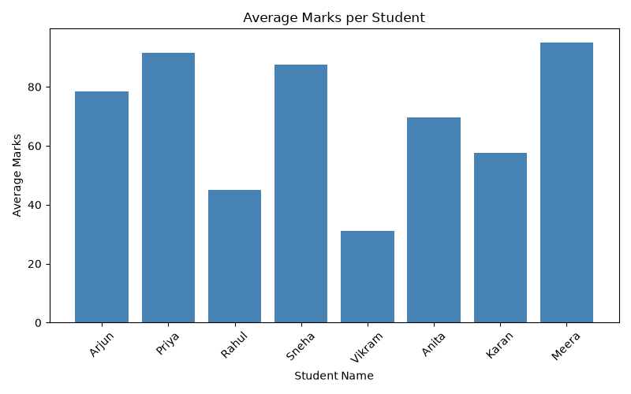

# Student Marks Analysis

## Problem
Analyze a dataset of student marks to identify the topper, calculate the class average, determine pass/fail results, and visualize performance.

## Dataset
A small dataset of 8 students with marks in Maths, Science, and English.

## Key Findings
- **Topper:** Meera with an average of 95.00
- **Class Average:** 69.5
- **Failed Students:** 1 (Vikram)
- **Pass Rule:** A student passes only if they score 40 or more in every subject

## Chart


## Live Dashboard
[View Live Dashboard](https://student-marks-analysis-dashboard.streamlit.app)


To run it locally:
```bash
python -m streamlit run app.py
```

## Tools Used
- Python
- pandas (data loading and analysis)
- matplotlib (visualization)
- Streamlit (interactive dashboard)

## Project Structure
```text
student-marks-analysis/
├── data/
│   └── marks.csv          # Raw student marks data
├── outputs/
│   └── average_marks.png  # Generated bar chart
├── src/
│   └── analysis.py        # Analysis script
├── app.py                 # Streamlit dashboard
├── .gitignore
├── LICENSE
├── README.md
└── requirements.txt
```

## How to Run
1. Install dependencies:

   ```bash
   pip install pandas matplotlib streamlit
   ```

2. Run the analysis script from the project root:

   ```bash
   python src/analysis.py
   ```

3. Run the interactive dashboard:

   ```bash
   python -m streamlit run app.py
   ```

## Output
- Prints the full data table with total, average, and result columns
- Prints topper and class average
- Saves a bar chart to `outputs/average_marks.png`
- Displays an interactive web dashboard

## Blog

Read the full write-up on [_Dev.to_](https://dev.to/sagarmaurya/building-a-student-marks-dashboard-from-data-to-live-web-app-3hgd)
